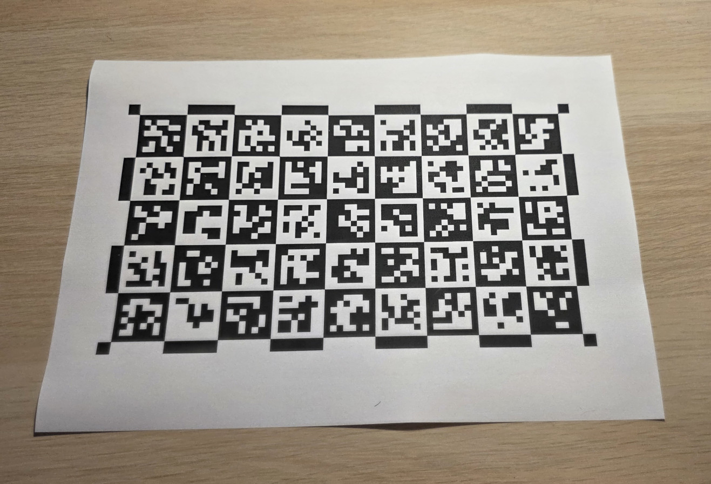
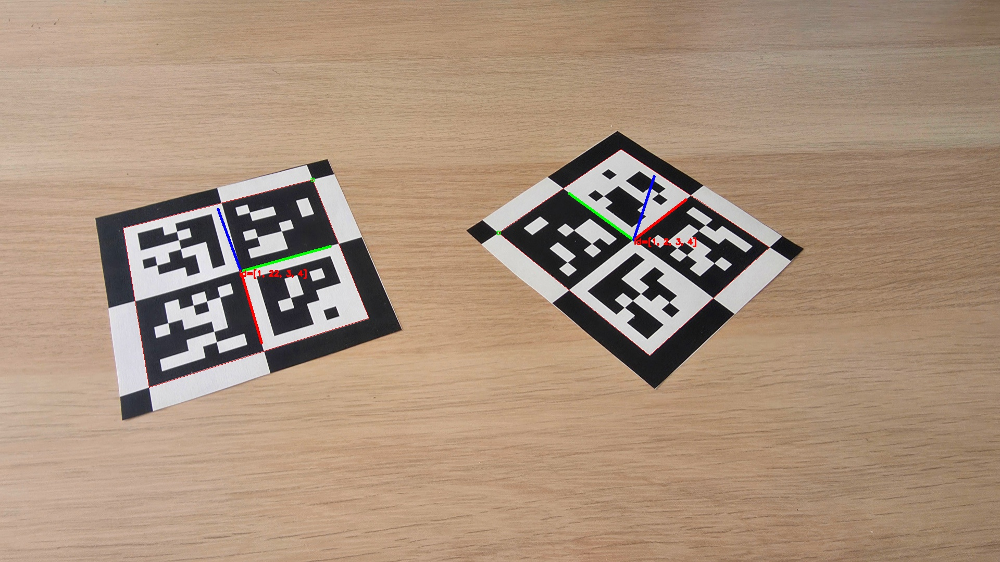

# ChArUco2

Enhanced calibration boards with dual black-and-white marker detection.

## Introduction

ChArUco2 is a C++ library that extends the standard OpenCV ChArUco framework by placing ArUco markers in **every** square of the board — standard markers in black squares and inverted markers in white squares — and by redesigning the ChArUco diamond for improved pose estimation accuracy.

<p align="center">
  
  &nbsp;
  
</p>

Key advantages over standard OpenCV ChArUco:

* **Double marker density**: every square carries a marker, yielding $N \times M$ markers on an $N \times M$ board versus $\approx NM/2$ in the standard design.
* **Larger markers**: each marker occupies the full square area (no white border needed), improving detection range and robustness under challenging lighting.
* **More reference corners**: $(N{+}1) \times (M{+}1)$ observable corners including the board border, versus $(N{-}1) \times (M{-}1)$ inner corners in standard ChArUco.
* **Better diamond**: the ChArUco2 diamond is a $2{\times}2$ all-marker block that exposes 9 reference points spanning the full marker extent, versus 4 inner corners in the standard diamond — twice the geometric baseline and more than twice the observations.
* **Drop-in compatible**: same output types as `cv::aruco::CharucoDetector`; detected corners feed directly into `cv::calibrateCamera()` and `cv::solvePnP()`.

## Installation

Copy `charuco2.h` and `charuco2.cpp` into your project.

### Dependencies
* OpenCV >= 4.7
* C++17

### Build the examples

```bash
mkdir build && cd build
cmake ..
make
```

## Usage

### 1. Board generation

```cpp
#include "charuco2.h"
#include <opencv2/opencv.hpp>

int main() {
    cv::aruco::Dictionary dict =
        cv::aruco::getPredefinedDictionary(cv::aruco::DICT_ARUCO_MIP_36h12);
    cv::aruco::CharucoBoard2 board(cv::Size(9, 5), 0.026f, 0.0f, dict);
    cv::Mat boardImg;
    board.generateImage(cv::Size(1800, 1000), boardImg);
    cv::imwrite("charuco2_board.png", boardImg);
    return 0;
}
```

### 2. Board detection

```cpp
// board created as above
cv::aruco::CharucoDetector2 detector(board);
cv::Mat image = cv::imread("input.jpg");
std::vector<cv::Point2f>              charucoCorners;
std::vector<int>                      charucoIds;
std::vector<std::vector<cv::Point2f>> markerCorners;
std::vector<int>                      markerIds;
detector.detectBoard(image, charucoCorners, charucoIds, markerCorners, markerIds);
cv::aruco::drawDetectedCornersCharuco(image, charucoCorners, charucoIds);
cv::imwrite("detected.jpg", image);
```

### 3. Camera calibration

```cpp
cv::aruco::CharucoBoard2    board(cv::Size(9, 5), 0.026f, 0.0f, dict);
cv::aruco::CharucoDetector2 detector(board);
std::vector<cv::Mat> allObjPts, allImgPts;
cv::Size imageSize;

for (auto& path : imagePaths) {
    cv::Mat image = cv::imread(path);
    imageSize = image.size();
    std::vector<cv::Point2f> corners;
    std::vector<int>         ids;
    detector.detectBoard(image, corners, ids, {}, {});
    if (ids.size() >= 6) {
        cv::Mat objPts, imgPts;
        board.matchImagePoints(corners, ids, objPts, imgPts);
        allObjPts.push_back(objPts);
        allImgPts.push_back(imgPts);
    }
}
cv::Mat K, dist;
std::vector<cv::Mat> rvecs, tvecs;
cv::calibrateCamera(allObjPts, allImgPts, imageSize, K, dist, rvecs, tvecs);
```

### 4. Diamond detection and pose estimation

```cpp
cv::aruco::CharucoBoard2    dboard(cv::Size(2, 2), 0.04f, 0.0f, dict);
cv::aruco::CharucoDetector2 ddetector(dboard);
cv::Mat image = cv::imread("input.jpg");
std::vector<std::vector<cv::Point2f>> dCorners;
std::vector<cv::Vec4i>                dIds;
std::vector<std::vector<cv::Point2f>> mCorners;
std::vector<int>                      mIds;
ddetector.detectDiamonds(image, dCorners, dIds, mCorners, mIds);

for (size_t dc = 0; dc < dCorners.size(); dc++) {
    cv::Mat objPoints, imgPoints;
    dboard.matchImagePoints(dCorners[dc], dIds[dc], objPoints, imgPoints);
    cv::Vec3d rvec, tvec;
    cv::solvePnP(objPoints, imgPoints, camMatrix, distCoeffs, rvec, tvec);
    cv::drawFrameAxes(image, camMatrix, distCoeffs, rvec, tvec, 0.04f);
}
cv::imwrite("pose.jpg", image);
```

## Detection performance

Comparison of ChArUco and ChArUco2 on a 9×5 board (26 mm squares, DICT_ARUCO_MIP_36h12) under partial occlusion (mean over five images per level):

| Occlusion | ChArUco markers | ChArUco2 markers | ChArUco corners | ChArUco2 corners |
|:---------:|:---------------:|:----------------:|:---------------:|:----------------:|
| 0%        | 22              | 45               | 32              | 60               |
| 25%       | 17              | 35               | 24              | 48               |
| 50%       | 12              | 25               | 16              | 36               |
| 75%       | 5               | 10               | 4               | 12               |

At 75% occlusion, standard ChArUco recovers only 4 corners (often collinear and unsuitable for calibration), while ChArUco2 still recovers 12.

## Citation

If you use ChArUco2 in your research, please cite:

> R. Muñoz-Salinas, F. J. Romero-Ramirez, S. Garrido-Jurado, "ChArUco2: Enhanced Calibration Boards with Dual Black-and-White Marker Detection", SoftwareX, 2026.

Please also cite the foundational ArUco papers:

1. S. Garrido-Jurado et al., "Automatic generation and detection of highly reliable fiducial markers under occlusion", Pattern Recognition, 2014.
2. F. J. Romero-Ramirez et al., "Speeded up detection of squared fiducial markers", Image and Vision Computing, 2018.

## License

MIT License.

## Acknowledgments

This research has been funded by the PID2023-147296NB-I00 project of the Ministry of Science, Innovation, and Universities of Spain.
